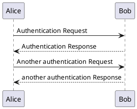

# pandoc-asciiart-filter

pandoc2 filter that converts embedded asciiart to nicely rendered graphics

filters codeblocks annotated with ```ditaa``` or ```plantuml```, shells out to render those
codeblocks (jdk1.8+ needed), caches images in ```rendered/``` subdir, re-renders them only
on change (significant speedup)


## prerequisites

* pandoc 2+
* jdk1.8+
* make


## installation

```
make
```
loads all needed libraries and puts them in the ```lib/``` folder.


## usage

```
pandoc \
	README.md \
	--lua-filter render-asciiart-filter.lua \
	-o README.pdf
```


## example

the following codeblocks should be rendered as graphics, inspect the
[generated pdf](README.pdf).

```ditaa
    +--------+   +-------+    +-------+
    |        | --+ ditaa +--> |       |
    |  Text  |   +-------+    |diagram|
    |Document|   |!magic!|    |   a   |
    |     {d}|   |       |    |       |
    +---+----+   +-------+    +-------+
        :                         ^
        |       Lots of work      |
        +-------------------------+
```


